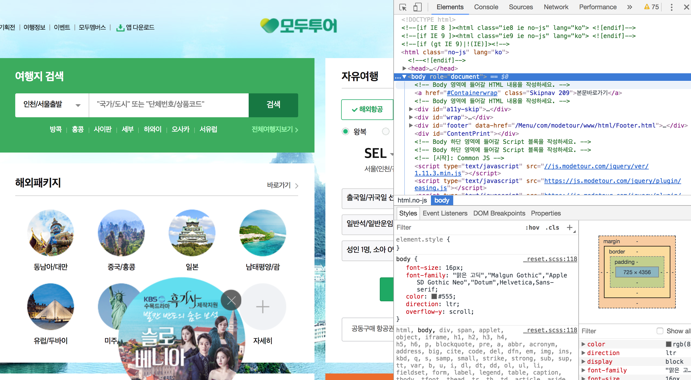

# travel_scrapper

1. 크롬에서 웹페이지의 html코드 보기  
서버에 요청해서 가져온 웹페이지를 크롤링하기 위해서는 웹페이지를 구성하는 html의 구조를 파악하는 것이 필요함.  
크롬에서 오른쪽 상단의 주소 옆에 점세개를 클릭 -> 도구 더보기 -> 개발자도구 를 선택하면 html코드를 볼 수 있다.  
  

2. 특정 페이지의 html 코드를 가져오기  
urllib2와 BeautifulSoup 패키지 활용해서 모두투어 페이지의 html코드를 가져오는 간단한 코드를 구현해보자
~~~python
from urllib2 import urlopen  
from bs4 import BeautifulSoup  

html = urlopen("https://www.modetour.com/main/")
bsObj = BeautifulSoup(html.read(), "html.parser")

print('==== full tag ====')
print(bsObj)
~~~

일단은 urlopen()이라는 함수로 data를 가져오고 이 data를 BeautifulSoup패키지로 원하는 내용을 가져올 수 있는 것으로 보인다.
urlopen()함수로 가져온 data값의 타입은 뭔지, 그리고 BeautifulSoup패키지 활용방법에 대해 스터디가 필요할 것 같다.
urllib에 대해서는 다음 링크의 내용을 참고해보자
https://docs.python.org/2/library/urllib2.html
~~~
urllib2.urlopen(url[, data[, timeout[, cafile[, capath[, cadefault[, context]]]]])¶
Open the URL url, which can be either a string or a Request object.
~~~
